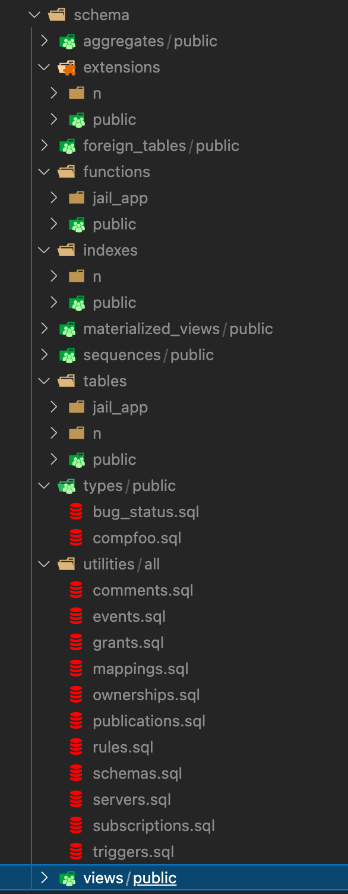

# pg_schema_dump_parser
Generates nicely parsed schema files.

Every schema qualified object is parsed into its own schema file while non-schema qualified objects are parsed as utilities with
a generic schema name `all`.

## Requirements
- python3.9 and above
- pg_dump
- psql

## Sample parsed schema


## Running the program
- Create `pg_schema_dump_parser.config` with template `pg_schema_dump_parser.config.sample` replacing the necessary values
- Then you can call the program as such:
  ```
  ./pg_schema_dump_parser.py --directory . --configfile pg_schema_dump_parser.config
  ```
  P.S In the above example, (.) translates to the current working directory.
